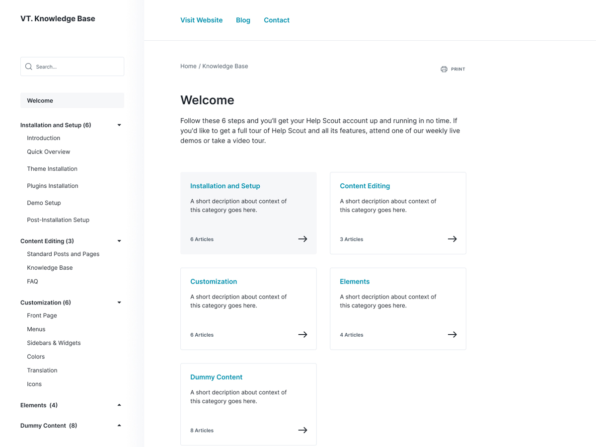

# KnowPress - [Demo](demo.vitathemes.com/knowpress) | [Download](https://wordpress.org/themes/knowpress/)
KnowPress is a fast and minimal theme for documentation sites.



## Features
* Compatible with [WeDocs](https://wordpress.org/plugins/wedocs/)
* No additional JS
* Sass for stylesheets
* Compatible with [Contact Form 7](https://wordpress.org/plugins/contact-form-7)
* Fast & lightweight (Google Speed (PageSpeed Insights): 100/100)
* Theme options built directly into WordPress native live theme customizer
* Responsive design
* Cross-browser compatibility
* Custom Google WebFonts
* Child themes support
* Developer friendly extendable code
* Translation ready (with .POT files included)
* Right-to-left (RTL) languages support
* SEO optimized
* GNU GPL version 2.0 licensed
* …and much more

See a working example at [demo.vitathemes.com/knowpress](demo.vitathemes.com/knowpress).

## Theme installation

1. Simply install as a normal WordPress theme and activate.
2. Install recommended plugins
3. In your admin panel, navigate to `Appearance > Customize`.
4. Put the finishing touches on your website by adding a logo, typography settings, custom colors and etc.

## Theme structure

```shell
themes/knowpress/          # → Root of your theme
│── assets/               # → All assets goes here
│   │── css               # → Compiled css
│   │── fonts             # → Fonts
│   │── js                # → Js files
│   └── src               # → source files
├── languages/            # → Theme Language files
├── template-parts/       # → Theme Part files (Include)
├── node_modules/         # → Node.js packages
├── package.json          # → Node.js dependencies and scripts
│── classes/              # → Custom PHP classes
├── inc/                  # → Theme functions
│   ├── TGMPA/            # → TGMPA library
│   ├── customizer.php    # → All codes related to WordPress Customizer (We use Kirki Framework)
│   ├── template-functions.php    # → Custom template tweaks
│   └── template-tags.php         # → Custom template tags
│   └── hooks.php         # → Theme custom hooks
│   └── tgmpa-config.php         # → Configuration file for TGMPA
│── wedocs/               # → Custom WeDocs templates
└── page-templates/       # → Page Templates
```

## Theme setup

Edit `functions.php` to enable or disable theme features, setup navigation menus, post thumbnail sizes, and sidebars.

## Theme development

* Run `npm install` from the theme directory to install dependencies
* Run `gulp` from the root of theme directory and it's starting to watch any changes in scss files from the `assets/src/sass` folder

## License

KnowPress is licensed under [GNU GPL](LICENSE).
